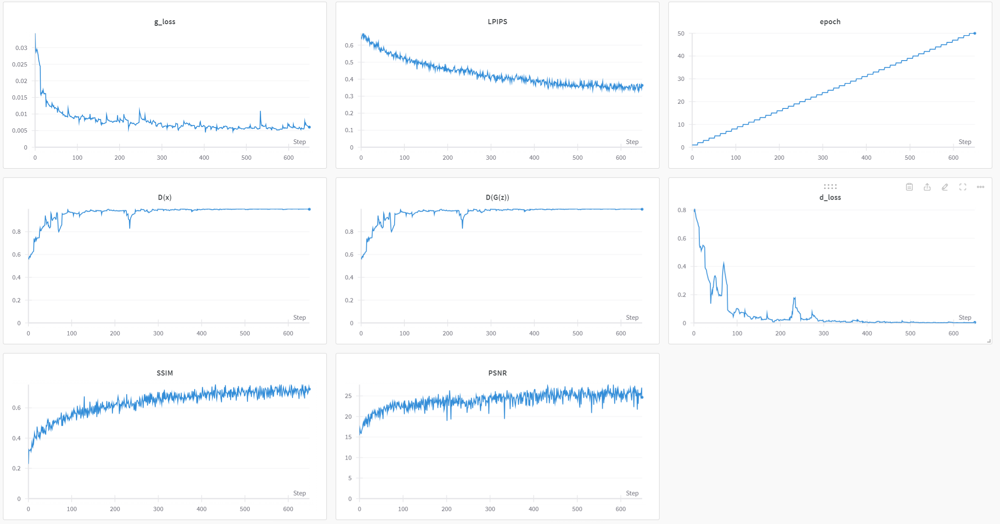

# Отчет

## Описание проекта
Целью данной работы было обучение модели для задачи увеличения разрешения изображений (Super-Resolution). Для обучения использовался набор данных **DIV2K**, а для тестирования — наборы данных **SET5** и **SET14**. В процессе работы были использованы различные потери (лоссы), а также метрики качества изображений, такие как **PSNR**, **SSIM** и **LPIPS**, для оценки качества сгенерированных изображений.

## Использованная модель
В качестве архитектуры модели выбран **SRGAN** — генеративно-состязательная сеть для увеличения разрешения изображений. SRGAN показала хорошие результаты в этой задаче. Использовались следующие функции потерь:

- **Adversarial Loss**: помогает генератору создавать изображения, которые могут обмануть дискриминатор, улучшая качество сгенерированных изображений.
- **Perceptual Loss**: измеряет разницу между сгенерированными и реальными изображениями с использованием признаков предобученной модели (VGG16), что улучшает перцептуальное качество.
- **Image Loss (MSE)**: минимизирует разницу на уровне пикселей между сгенерированными изображениями и реальными, улучшая четкость изображения.
- **TV Loss**: делает сгенерированные изображения более гладкими и реалистичными, уменьшая шум.

## Этапы выполнения работы

1. **Dataloader для DIV2K**: Была создана функция загрузки данных для набора изображений высокого разрешения DIV2K, на которых обучалась модель.
2. **Обучение модели**: Модель была обучена на DIV2K на небольшое количество эпох (вначале 5 эпох, затем 50 эпох). В процессе обучения использовались вышеупомянутые лоссы.
3. **Оценка метрик на SET5**: После первичного обучения были реализованы метрики PSNR, SSIM и LPIPS для оценки качества изображений на наборе SET5. Метрики были замерены для каждого изображения по отдельности.
4. **Обновление метрик для работы с батчами**: Метрики были переписаны для корректной работы с батчами изображений.
5. **Запуск обучения на 50 эпох**: Модель была обучена на 50 эпохах, при этом потери и метрики логировались в процессе обучения.
6. **Тестирование на SET5 и SET14**: После обучения модель была протестирована на наборах SET5 и SET14, и результаты метрик были сравнены с предыдущими результатами на 5 эпохах.

## Результаты и метрики

### Логирование с помощью Weights & Biases (Wandb)
Во время обучения метрики PSNR, SSIM и LPIPS, а также значения лоссов для дискриминатора и генератора были залогированы в **W&B**. Ниже представлены графики потерь и метрик, полученные за 50 эпох.

Ссылка на графики https://wandb.ai/digital-t/SRGAN_1/runs/hs2w5io4?nw=nwuserkirillkas

### Результаты на SET5
| Изображение | PSNR  | SSIM | LPIPS |
|-------------|-------|------|-------|
| Image 0     | 26.52 | 0.86 | 0.23  |
| Image 1     | 25.15 | 0.71 | 0.31  |
| Image 2     | 22.08 | 0.67 | 0.37  |
| Image 3     | 26.6  | 0.65 | 0.37  |
| Image 4     | 24.5  | 0.77 | 0.31  |

### Результаты на SET14
| Изображение | PSNR   | SSIM   | LPIPS  |
|-------------|--------|--------|--------|
| Image 0     | 22.38  | 0.5962 | 0.3743 |
| Image 1     | 25.93  | 0.8167 | 0.2809 |
| Image 2     | 24.85  | 0.7485 | 0.3941 |
| Image 3     | 24.41  | 0.5474 | 0.4795 |
| Image 4     | 19.27  | 0.5404 | 0.4913 |
| Image 5     | 26.57  | 0.6529 | 0.3732 |
| Image 6     | 22.63  | 0.6878 | 0.3374 |
| Image 7     | 24.90  | 0.8325 | 0.3141 |
| Image 8     | 26.04  | 0.8487 | 0.2348 |
| Image 9     | 25.92  | 0.7732 | 0.3492 |
| Image 10    | 26.74  | 0.9114 | 0.2077 |
| Image 11    | 25.50  | 0.8179 | 0.2450 |
| Image 12    | 20.60  | 0.8418 | 0.2290 |
| Image 13    | 19.81  | 0.5912 | 0.2505 |

## Заключение
В ходе работы была обучена и протестирована модель на основе SRGAN. Использование различных лоссов позволило улучшить качество изображений, а метрики PSNR, SSIM и LPIPS помогли объективно оценить результаты. Модель показала стабильные результаты на наборах данных SET5 и SET14.
